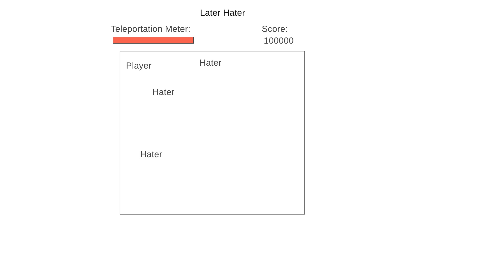

# Later Hater

## Background and Overview
Later Hater is a game with visuals modeled after the Vaporwave Aesthetic. Players will be able to teleport to places on the board to avoid 'haters' coming towards them. The catch: Every time you make a move, a brand new hater is lurking in the corner, waiting to ruin your good time.

## Functionality and MVPs
Players can click on a point in the map and their icon will appear there. Haters will generate and move towards the player. Teleportation ability refresh will limit teleports. Score will increase the longer a player lasts. 

## Wireframe

## Architecture and Technology 
* HTML/CSS
* Vanilla Javascript 

## Implementation Timeline
* Phase 1 (Day 1 & 2)
    * Research Vanilla Javascript DOM manipulation
    * Render basic boxes in wireframe
    * Render player with teleportation ability
    * Put a limit on teleportation ability
* Phase 2 (Day 3 & 4)
    * Add a score
    * Generate haters with every teleport and make them move towards the player
* Phase 3  Day 5
    * Complete HTML and CSS for site elements
    * Production README
    
 ## Visual Sources: 
 * Art Glitch Gif By Haydiroket (Mert Keskin)
 * Vaporwave Gif By Kotutohum
 * https://visualdon.uk/project/wormhole/
